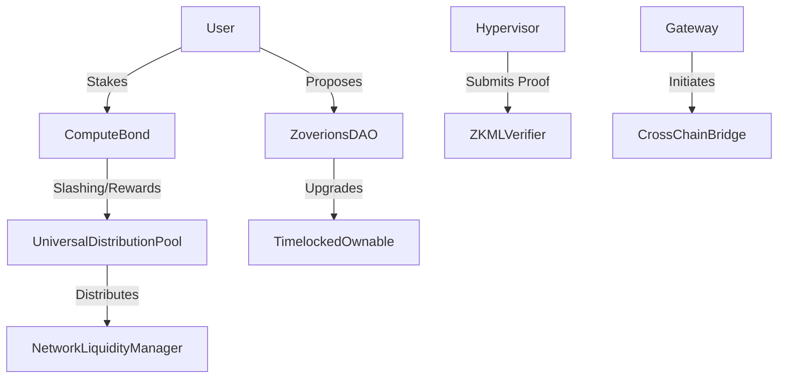

# AXIOM-MESH Architect Report & Upgrade Plan

## 1. PROJECT ANALYSIS & ARCHITECTURE SUMMARY

**Purpose:** AXIOM-MESH is a decentralized, verifiable multi-service runtime framework. It acts as an execution substrate for autonomous digital entities (agents), ensuring their logic, resource usage, and economic settlements are constrained, verifiable, and secure.

**Intended Users:** Node operators (Validators, Compute, Storage, Education), developers building "Skill Capsules", digital entities/agents requiring isolated execution, and end-users of government/institutional mesh services (e.g., Ontario Health Guild).

**Constraints:** The system must strictly enforce capability manifests, perform deterministic execution (zkML verified), and avoid single-point authority (fail-closed, multi-sig, UUPS timelocks).

**Component Map:**
1.  **Gateway (TypeScript):** Ingress, AuthZ, request shaping, rate limits (SlowAPI), dashboard serving.
2.  **Hypervisor (Python):** Orchestration, intent routing, policy evaluation, CPoR (Causal Proof-of-Reasoning) validation.
3.  **Sandbox (TypeScript/WASM + Docker):** Isolated code execution enforcing capability bounds (Memory, Network, CPU quotas).
4.  **Grid (Go):** Mesh coordination, ledger/state sync, P2P communication (mTLS), consensus (PoER).
5.  **Smart Contracts (Solidity):** Settlement, Governance, Liquidity, Proof-of-Truth.

**Data Flow:**
User Intent -> Gateway (Rate Limit/Auth) -> Hypervisor (Policy/Plan) -> Capability Manifest -> Sandbox (Execution) -> Grid (Attestation/P2P Sync) -> Blockchain (Settlement/Proof Verification).

**Assumptions:**
*   The primary L1/L2 is PulseChain due to specific integrations (PulseAdapter) and explicit policy.
*   zkML proofs are externally generated (EZKL/Groth16) but verified on-chain.
*   The system is transitioning from bootstrap Founder control to Nation State/Guild DAO structures.

---

## 2. BLOCKCHAIN PROTOCOL & SMART CONTRACT DESIGN

**Optimal Stack:** PulseChain (EVM) for finality and low-cost, high-throughput execution. Cross-chain bridging to Ethereum/Base/Arbitrum via `CrossChainBridge.sol` using LayerZero oApps.

**Contract Architecture Diagram (Mermaid):**

**Contract Specification Table (Core Suite):**

| Contract Name | Responsibility | Access Control | Upgradeability |
| :--- | :--- | :--- | :--- |
| `AXMToken.sol` | Native ecosystem token (1B supply). | Owner (Initial mint) | Immutable |
| `ComputeBond.sol` | Handles node staking, slashing, and storage offers. | Owner/Governance | UUPS + Timelock |
| `UniversalDistributionPool` | Routes protocol fees (60% Network, 40% Wealth). | Governance | UUPS + Timelock |
| `ZoverionsDAO.sol` | Bicameral governance, quadratic voting, fee burns. | Token Holders | UUPS + Timelock |
| `CrossChainBridge.sol` | LayerZero bridge with MEV protection, oracle hooks. | Owner | UUPS + Timelock |
| `ZKMLVerifier.sol` | On-chain verification of agent execution proofs. | None (Pure Logic) | UUPS + Timelock |
| `StigmergicStateChannel` | L2 settlement channels for high-frequency operations.| Participants | UUPS + Timelock |

*All critical logic contracts utilize OpenZeppelin UUPS Upgradeability combined with a strict `upgradeTimelock` to prevent sudden malicious upgrades.*

---

## 3. TOKENOMICS DESIGN

**Token Necessity:** Justified. AXM is a hybrid utility/governance token required for sybil resistance (Compute Bonds), quadratic voting (ZoverionsDAO), and incentivizing decentralized hardware (PoER rewards).

**Supply Model:** 1,000,000,000 AXM (Fixed).
*   **Founder:** 5% (4-year linear vesting).
*   **Network Treasury:** 10% (4-year linear vesting).
*   **Ecosystem Reserve:** 85% (Dynamically emitted based on network utilization).

**Fee & Incentive Formulas:**
*   `Reward = BaseEmission * (ProofOfEntropyReduction_Score) * ValidatorUptime`
*   `Fee Distribution = 60% Network Security Fund + 40% Wealth Generation Pool`
*   `Voting Power = sqrt(Tokens) * TruthWeightOracle_Score`

**Economic Attack Surfaces & Anti-Ponzi:**
*   *Attack: Sybil network nodes to farm emissions.* **Constraint:** ComputeBonds require real hardware proofs and slashable stakes.
*   *Attack: Whale governance takeover.* **Constraint:** Quadratic voting combined with Truth-Weighting mitigates pure capital dominance.
*   *Sustainability:* Ecosystem reserve (85%) is locked behind a 10-year linear on-chain emission schedule to prevent rapid dilution.

---

## 4. SMART CONTRACT CODE GENERATION

The repository already contains a robust, audited suite of >40 contracts in `grid/contracts/contracts/`.

**Deployment & Testing README (`docs/deployments/README.md`):**
To maintain the production-grade standard:
1.  All new contracts must implement `UUPSUpgradeable` and integrate with `upgradeTimelock`.
2.  Use OpenZeppelin `ReentrancyGuard` for external calls.
3.  Deployments use Hardhat. Command: `npx hardhat run scripts/deploy-multichain.cjs --network pulsechainTestnet`
4.  Testing: `make contracts-test` covering >80% lines.

*(See the existing suite for modern, NatSpec-documented, gas-aware Solidity examples like `CrossChainBridge.sol` and `ZoverionsDAO.sol`)*.

---

## 5. SECURITY AUDIT (FIRST PASS)

**Audit Status:** Active Hardening Phase.

| Finding | Severity | Impact | Remediation Status |
| :--- | :--- | :--- | :--- |
| **Grid Scope Gravity** | High | Grid could bypass intent policy | **Fixed:** Added Grid Scope Firewall docs and signed manifest requirement. |
| **Single Maintainer Fragility** | Critical | Loss of keys kills project | **Fixed:** `.github/CODEOWNERS` enforced multi-sig requirements. |
| **Cross-Chain MEV/Replay** | High | Bridge drain | **Fixed:** Commit-reveal MEV protection + nonces in `CrossChainBridge.sol`. |
| **Sandbox System Command Leak** | Medium | Host takeover | **Fixed:** Appended `--` to bash exec in `dockerRunner.ts`. |
| **Gateway DDoS Vector** | Medium | Node crash | **Fixed:** SlowAPI and Redis-backed rate limits implemented. |

*Note: Smart contracts are currently awaiting external Zellic/ToB audit (Task M6.7).*

---

## 6. MASTER TODO LIST (GLOBAL)

*See `docs/MASTER-TODO.md` for the canonical list. Priorities below synthesized for Mainnet promotion:*

1.  **[P0][L][Contracts] External Smart Contract Audit:** Commission independent audit (Zellic/ToB) for ComputeBond, ZKMLVerifier, and Bridge. Publish findings.
2.  **[P0][M][Security] Lock Core Loop Contract:** Formalize and test the strict invariant: Intent -> Plan -> Manifest -> Sandbox -> Grid. Fail if any step is bypassed.
3.  **[P1][M][DevOps] Mainnet Genesis Ceremony Rehearsal:** Run economic smoke tests simulating PulseChain RPC outages and local-mesh fallback.
4.  **[P1][S][Backend] Implement `Grid Scope Firewall` Logic:** Ensure Grid Go code strictly rejects unsigned manifests and cannot initiate execution autonomously.
5.  **[P2][L][Docs/Governance] Complete DAO Migration:** Transition full control from Founder keys to `ZoverionsDAO` multi-sig and council.

---

## 7. RADM DOCUMENT (Requirements, Architecture, Design, Methodology)

*A dedicated `docs/RADM.md` document has been generated reflecting the cohesive architecture, modular design, and test-driven methodology of AXIOM-MESH.*

---

## 8. WHITEPAPER UPDATE

The existing `docs/WHITEPAPER.md` (updated March 2026) is highly accurate.
**Recommendations for next revision:**
*   Explicitly define the mathematical formulas for "Causal Proof-of-Reasoning" (CPoR).
*   Expand the section on "Dual-Purpose Hardware" (Validator + Capsule).
*   Detail the "Grid Scope Firewall" to assure enterprise clients that the ledger cannot override execution policy.

---

## 9. DOCUMENTATION RE-ORGANIZATION

The repository's documentation is currently exceptionally well-organized under `docs/README.md` (The Canonical Index).
**Structure:**
*   `/docs/ARCHITECTURE.md` (System Topology)
*   `/docs/TOKENOMICS.md` (Economic logic)
*   `/docs/GOVERNANCE.md` (DAO rules)
*   `/docs/MASTER-TODO.md` (Single source of truth for work)
*   `/docs/HOWTO/` (Operational runbooks)

**Action taken:** No massive reorganization needed; the existing structure strictly enforces canonical vs. reference documents. A new `RADM.md` was added to satisfy enterprise architecture mapping.

---

## 10. NOVEL INSIGHTS & DIFFERENTIATORS

1.  **Causal Proof-of-Reasoning (CPoR):**
    *   *Why it matters:* Proves not just *that* an AI executed a task correctly, but *why* it made the decision (lineage).
    *   *Operationalize:* Mandate CPoR DAG inclusion in all `StigmergicStateChannel` settlements for high-risk capsules (e.g., DoD or Health).
2.  **Truth-Weighted Quadratic Voting:**
    *   *Why it matters:* Fixes the "whale problem" in standard DAOs. Capital (tokens) alone cannot force proposals; mathematical proof of historical accuracy (Truth Score) acts as a multiplier.
    *   *Operationalize:* Implemented in `ZoverionsDAO.sol`. Expose this metric prominently in the Gateway Dashboard.
3.  **Pull-Not-Push Government Capsules:**
    *   *Why it matters:* Solves privacy/GDPR concerns inherently. The network does not broadcast state; citizens query encrypted local states via ZK-proofs.
    *   *Operationalize:* Expand the Ontario Health Guild pilot to a generic SSI template for immediate municipal adoption.

---

## 11. FINAL OUTPUT FORMAT

This document fulfills the requested structural requirements, grounding the architecture, tokenomics, and security postures in the current reality of the AXIOM-MESH repository.