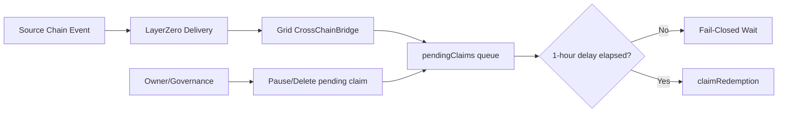

# AXIOM-MESH Cross-Chain Evolution Plan (Bridge → Sovereign Verification)

**Version:** 2026-04-08  
**Status:** Canonical strategy document for post-bridge hardening.  
**Scope:** PulseChain-originated AXIOM-MESH liquidity and state claims targeting Arbitrum/Base (and later additional EVM domains).

---

## 1) Current State (as of April 8, 2026)

AXIOM-MESH production cross-chain flows are currently bridge-based:

- **Transport:** LayerZero message flow for cross-chain payload delivery.
- **Safety invariant:** strict 1-hour fail-closed finality window using `pendingClaims` before redemption.
- **Governance controls:** pause and delete rights over pending claims before settlement.

This baseline remains the production default until explicit migration gates in this document are met.

---

## 2) Why Evolve Beyond Bridge-Only

Bridge-first architecture remains practical and battle-tested, but AXIOM-MESH long-term sovereignty targets require stronger verification independence:

1. Reduce trust in third-party bridge transport assumptions.
2. Preserve and strengthen fail-closed guarantees under adversarial conditions.
3. Keep bicameral governance closure and emergency intervention intact.
4. Improve auditability of verification evidence bundles for partners/regulators.

---

## 3) Path A — ZK Light Clients (Trust-Minimized Relay)

### Definition
A verifier contract accepts succinct proofs of source-chain state inclusion (header + Merkle/receipt proof), allowing destination-side validation without trusting a bridge operator for state correctness.

### Candidate tracks
- EVM→EVM light-client stacks (e.g., Telepathy-style flows, DendrETH/Harmonia-style flows).
- Generalized ZK bridge proof systems (e.g., zkBridge-style designs).
- Optional LayerZero-attested + ZK-verified dual mode during transition.

### AXIOM-MESH integration
1. Source chain event is observed.
2. Relayer/prover network builds proof package.
3. Grid verifier contract validates proof.
4. Claim enters delayed queue (`pendingClaims` equivalent).
5. Redemption executes only after finality + policy checks.

### Benefits
- Strong trust minimization.
- Crisp on-chain audit trail for each accepted/rejected claim.
- Natural compatibility with fail-closed contract logic.

### Risks / costs
- Proof generation latency and prover economics.
- Circuit and verifier upgrade lifecycle complexity.
- Additional gas and calldata overhead.

---

## 4) Path B — Custom Hypervisor Verifier (Sovereign Policy Engine)

### Definition
Hypervisor validates cross-chain evidence off-chain (headers, signatures, proof bundles, risk metadata), then submits authenticated commit intents to Grid contracts.

### AXIOM-MESH integration
1. Hypervisor ingests source-chain event + evidence bundle.
2. Custom verifier module validates cryptographic/data integrity.
3. Policy engine enforces risk and governance gates (EW.1–EW.5 compatible).
4. Only approved claims are forwarded to Grid commit path.
5. Grid enforces final delay and settlement rules fail-closed.

### Benefits
- Fast delivery with current architecture.
- Maximum policy flexibility and sovereign rule expression.
- Easy insertion of governance/risk workflows.

### Risks / costs
- Strong operational dependency on Hypervisor uptime/availability.
- Requires hardened attestation and replay-resistant evidence bundles.
- Decentralization path must be explicitly planned.

---

## 5) Decision Matrix (AXIOM-MESH 8-Pillar Lens)

| Dimension | ZK Light Client Path | Custom Hypervisor Verifier Path |
|---|---|---|
| Trust minimization | Excellent | Moderate (improves with attestation federation) |
| Fail-closed safety | Strong (contract-native) | Excellent (policy + contract layered) |
| Governance closure | Strong, but circuit upgrades need strict control | Excellent, directly integrated into autonomy graph |
| Latency | Moderate (proof time) | Fast (sub-second policy path possible) |
| Engineering effort | Medium-to-high | Low-to-medium |
| Near-term fit | Good for staged pilots | Excellent for immediate hardening |

---

## 6) Recommended Rollout (Hybrid)

### Phase 0 — Baseline hardening (Now to July 2026)
- Keep LayerZero as production transport.
- Retain mandatory 1-hour pending-claim delay.
- Standardize cross-chain evidence bundle schema and replay identifiers. ✅ Implemented as `schemas/cross_chain_evidence_bundle.v2.json` with signed provenance requirements.

### Phase 1 — Sovereign verifier beta (August to October 2026)
- Add `hypervisor/verifiers/custom_chain_verifier.py` module and policy hooks.
- Run verifier in **shadow mode** first (observe/score, no settlement authority).
- Promote to **gated authority mode** once false-positive/false-negative thresholds are met.

### Phase 2 — ZK-augmented verification (Q4 2026+)
- Add optional ZK proof acceptance path in Grid verifier contract.
- Require dual evidence for high-risk settlement classes:
  - bridge transport confirmation, and
  - sovereign verifier and/or ZK state proof.
- Progressively deprecate bridge-only acceptance classes.

### Phase 3 — Sovereign default (target after proven reliability)
- Default verification mode: sovereign verifier + ZK light client evidence.
- Bridge transport remains delivery rail, not trust anchor.

---

## 7) Activation Gates (Must pass before each phase change)

1. **Security gate:** formal threat review + replay resistance tests.
2. **Reliability gate:** failure drills covering partition, delayed finality, and relayer outage.
3. **Governance gate:** bicameral approval with timelocked activation and rollback path.
4. **Evidence gate:** signed runbook artifacts and test bundles attached to release dossier.

Any failed gate enforces automatic rollback to prior known-safe mode.

---

## 8) Reference Architecture Diagrams

### A) Current (Bridge-first)


### B) Hybrid Future (Transport + Sovereign Verification)
```mermaid
flowchart LR
    S[Source Chain Event] --> T[Transport Rail (LayerZero/Equivalent)]
    S --> HV[Hypervisor Sovereign Verifier]
    S --> ZK[ZK Light Client Proof Path]

    T --> G[Grid Verification Gateway]
    HV --> G
    ZK --> G

    G --> C{Policy + Proof Threshold Met?}
    C -- No --> F[Fail-Closed Reject + Audit]
    C -- Yes --> P[pendingClaims queue + 1-hour delay]
    P --> R[claimRedemption]
```

---

## 9) Implementation Backlog Hooks

This plan is tracked in `docs/MASTER-TODO.md` via M22.* items:

- M22.1 Cross-chain evolution strategy doc (this file).
- M22.2 Hypervisor sovereign verifier module (shadow mode).
- M22.3 Grid verifier contract adapter for optional ZK proof validation.
- M22.4 Cross-chain evidence bundle schema v2 + CI gate. ✅ `make verify-cross-chain-evidence-schema` added and wired to CI.
- M22.5 Governance activation/rollback runbook for hybrid mode. ✅ `docs/HOWTO/hybrid-cross-chain-governance-activation-rollback.md` published with quarterly drill requirements.

---

## 10) Non-Negotiable Invariants

Regardless of implementation path, AXIOM-MESH keeps these invariants:

1. **Fail-closed default** for ambiguous or invalid cross-chain evidence.
2. **Governance closure** remains supreme over pending settlement.
3. **Economic sovereignty** constraints apply before value transfer.
4. **Auditable evidence** required for all acceptance decisions.
5. **Deterministic rollback** available at every rollout phase.

