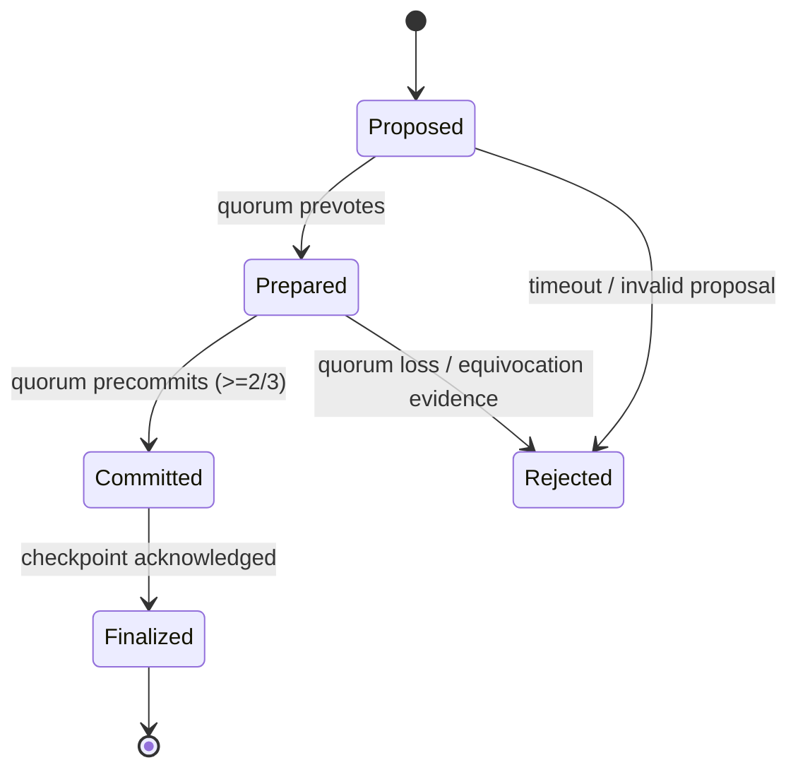

# GRID Consensus Spec (Staging Baseline)

**Status:** Staging hardening baseline (April 8, 2026)  
**Scope:** Clarifies consensus/finality semantics for AXIOM-MESH Grid and the contract-governed upgrade path.

---

## 1) Design Goals

1. Preserve **fail-closed execution guarantees** across runtime pillars.
2. Provide deterministic **state finality checkpoints** for Hypervisor and Sandbox policy decisions.
3. Separate concerns cleanly between:
   - **Grid node consensus engine (Go)** for liveness/finality signals.
   - **Governance contracts (Solidity)** for policy, upgrade authorization, and treasury controls.

---

## 2) Consensus Model (Current Baseline)

Grid operates as an authority-based consensus network for staging and controlled federation deployments.

- **Validator set:** Explicitly allowlisted nodes with mTLS identities.
- **Block proposal:** Round-based proposer rotation among active validators.
- **Commit rule:** A block is considered committed when a supermajority quorum signs the round commit (target: ≥2/3 of active voting weight).
- **Finality:** Committed blocks are treated as final for runtime policy purposes; reorgs are considered protocol faults and trigger fail-closed behavior.

> Implementation note: this document defines operational semantics for reviewers and operators; code-level constants remain authoritative in Grid source.

---

## 3) Runtime State Machine (Operator View)

### Safety Invariants

- **No half-open capability grants:** Hypervisor applies capability transitions only after `Committed` + checkpoint acknowledgment.
- **No execution on stale epochs:** Sandbox rejects jobs if consensus epoch or validator set hash mismatches trusted checkpoint.
- **Partition handling:** If quorum cannot be reached in bounded time, system degrades to read-only or deny-by-default behavior.

---

## 4) Upgrade & Governance Path

Contract upgrades follow a controlled two-phase flow:

1. **Proposal & Vote (on-chain governance contract):**
   - Proposal includes code hash/artifact digest, migration metadata, activation epoch.
2. **Activation Gate (off-chain + on-chain):**
   - Grid nodes verify governance approval proof and artifact digest before activating.

### Required Controls

- Timelock window before activation.
- Emergency veto / pause authority defined in governance policy.
- Rollback plan with explicit compatibility constraints and state migration checks.

---

## 5) Failure Scenarios and Required Behavior

- **Validator quorum loss:** Enter degraded mode; deny state-mutating intents.
- **Clock skew beyond tolerance:** Reject signatures outside skew bounds; emit critical alert.
- **Equivocation evidence:** Quarantine validator identity, rotate trust material, and require governance adjudication.
- **Contract/governance mismatch:** Refuse activation and remain on last finalized release.

---

## 6) Verification Hooks

Recommended CI/ops checks for this spec:

- Consensus simulation tests for quorum loss and network partitions.
- Upgrade rehearsal in staging with digest verification and timelock enforcement.
- Finality-lag SLO monitors exported to Prometheus/Grafana.
- Evidence bundle inclusion: validator set hash, commit certificates, activation proofs.

---

## 7) Out of Scope (for this baseline)

- Permissionless validator admission.
- Cross-chain optimistic finality assumptions.
- Economic slashing design details (to be defined in governance/economics expansion docs).

---

## 8) Canonical References

- `grid/README.md`
- `docs/architecture/ARCHITECTURE.md`
- `docs/TECHNICAL-SPECIFICATION.md`
- `docs/governance/GOVERNANCE.md`
- `docs/runbooks/crosschain-bridge-finality.md`
