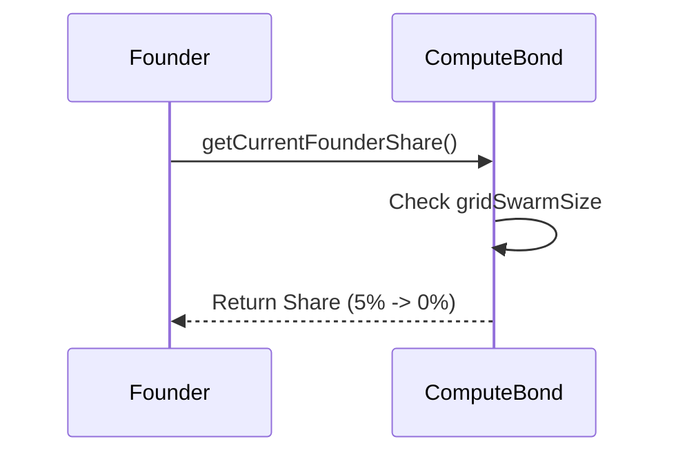

# HOWTO: Founder Claim (FDBA)

## Overview
This document outlines the procedure to view or use the Founder Decaying Bootstrap Allocation (FDBA).

## Description
The AXIOM-MESH starts with exactly 5.00% initial control allocation for the founder address (`0x1c2cbabf75e1938ed2f2c59e734e83aa5fbe1b73`). This linearly decays to 0% at 10,000 active nodes.

## Architecture

## Steps
1. Deploy the network.
2. Set the Founder Address in `.env` using `FDBA_FOUNDER_ADDRESS`.
3. Read the `getCurrentFounderShare()` function directly from the `ComputeBond` smart contract on the blockchain.
4. If swarm size < 10k, the share will reflect a value proportional to `500 - (s * 500 / 10000)`. When it hits 10k, the share hits 0.

## Version History
- **v16.0.0-Lockdown**: Validated FDBA behavior alongside robust execution closures.
- **v15.5.1-Lockdown**: Fully Integrated FDBA.