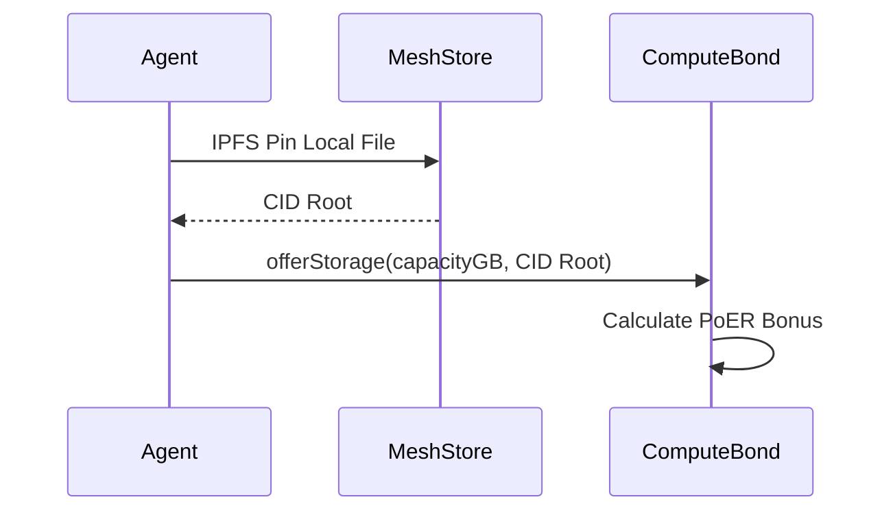

# HOWTO: MeshStore Claim

## Overview
This document outlines the procedure for an agent to offer storage to the decentralized MeshStore.

## Prerequisites
- AXIOM-MESH CLI configured
- Active node bond

## Architecture

## Steps
1. In the `install.sh` sequence or the `make cli` prompt, input your MeshStore contribution (default is 50GB).
2. The agent automatically writes `MESHSTORE_QUOTA_GB` to the `.env` file.
3. During the Grid's background syncing loop or through the CLI directly, a call to `offerStorage` is made on `ComputeBond.sol` using the agent's pinned CID root.

## Version History
- **v15.5.1-Lockdown**: Initial formalization.