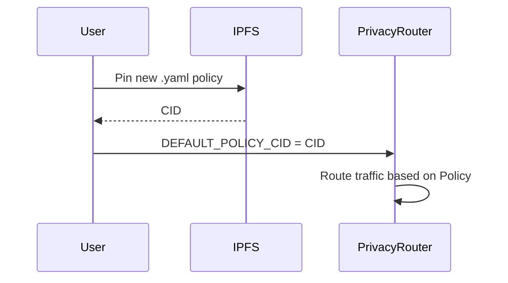

# HOWTO: NemoClaw Policy

## Overview
This document outlines how NemoClaw OpenShell policies are configured and updated.

## Architecture


## Steps
1. Create a `default.yaml` in `sandbox/policies/`.
2. Add your policies:
   ```yaml
   sandbox:
     filesystem: ["/meshstore/**"]
     network: ["ncp-servers"]
     privacy:
       level: local-only
   ```
3. Run `ipfs add -q sandbox/policies/default.yaml` to get the CID.
4. Export the CID to your `.env` as `DEFAULT_POLICY_CID=<CID>`.
5. The PrivacyRouter in `hypervisor/src/engine/privacy_router.py` will pull this configuration to dynamically route sensitive data.

## Version History
- **v15.5.1-Lockdown**: Introduced `zkml-local` and `zkml-external` routing constraints.