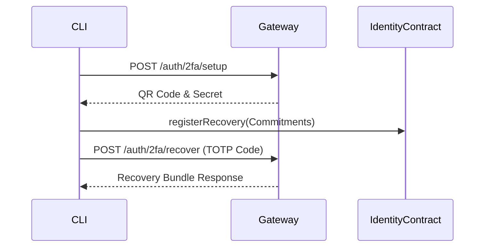

# HOWTO: Recovery 2FA

## Overview
This document outlines how an agent or user can recover a Node ID using TOTP and MeshStore encrypted bundles.

## Architecture

## Steps
1. During `make cli`, specify `y` to "Enable 2FA (TOTP + Passkey) for recovery?".
2. The Gateway will generate a TOTP secret and QR Code.
3. The commitment is registered on-chain via `registerRecovery` on the DualLedgerIdentity contract.
4. If a recovery is needed, execute the CLI using `python3 cli/axiom_cli.py recover` and provide the Node ID and TOTP code.

## Backup Provider Options (Recovery Continuity)

The backup API supports the following provider targets:

- `meshstore` (IPFS-compatible API; decentralized default)
- `aws-s3` (presigned URL upload/download flow)
- `gdrive` (Google Drive access token)
- `onedrive` (Microsoft Graph access token)

Recommended posture:
1. Keep MeshStore/IPFS as the primary decentralized persistence layer.
2. Mirror encrypted bundles to one or more cloud providers for disaster recovery.
3. Rotate access credentials/tokens through your secret manager.

## Version History
- **v16.0.0-Lockdown**: Validated bundle integration with IPFS pinning natively in `lifespan`.
- **v15.5.1-Lockdown**: Standardized procedure.
