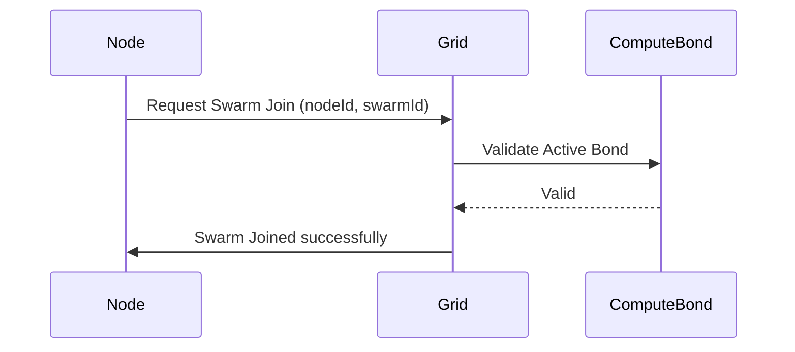

# HOWTO: Swarm Join

## Overview
This document outlines the procedure to join an existing swarm in the AXIOM-MESH network.

## Prerequisites
- AXIOM-MESH CLI configured (`make cli`)
- A generated `Node ID`
- An existing active bond on the network

## Architecture


## Steps
1. Run the Axiom CLI:
   ```bash
   make cli
   ```
2. When prompted "Joining existing cluster? (y/N):", enter `y`.
3. Provide your `Node ID`, the `parent node ID` to delegate your bond to, and the `Swarm ID`.
4. The CLI will interact with the grid API (`http://localhost:8080/swarm/join`) and output a success response.

## Version History
- **v15.5.1-Lockdown**: Initial formalization.