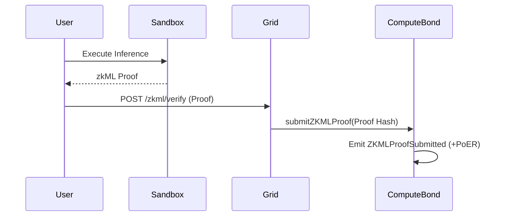

# HOWTO: zkML Inference

## Overview
This document outlines how an agent or user submits an enterprise-grade zkML proof for verification on the Grid network.

## Architecture

## Steps
1. The Sandbox uses EZKL or RISC Zero locally to generate a proof (stubbed in `sandbox/src/main.rs`).
2. The user passes this payload to the Grid via `POST /zkml/verify`.
3. The deterministic worker queue evaluates the payload against the Python ezkl worker.
4. On-chain validation can be explicitly checked via `submitZKMLProof` in `ComputeBond.sol` to gain the +300% PoER boost.

## Version History
- **v15.5.1-Lockdown**: Fully realized enterprise zkML implementation.