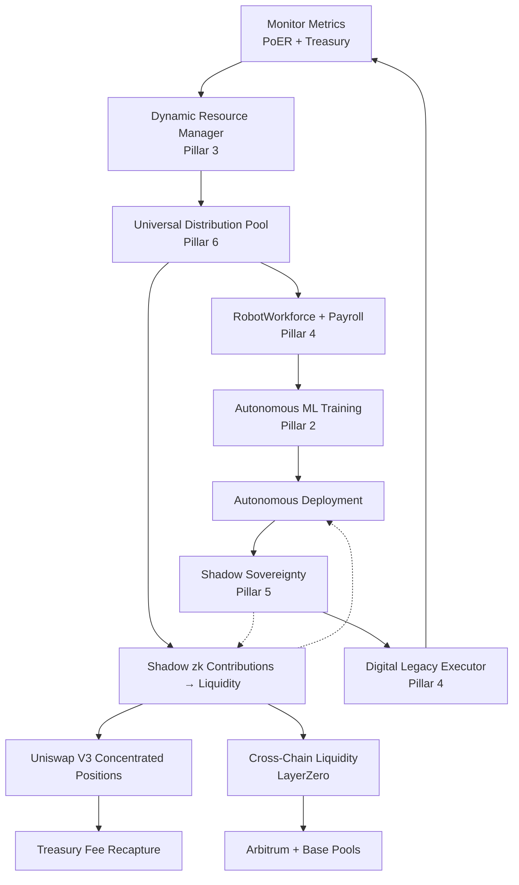
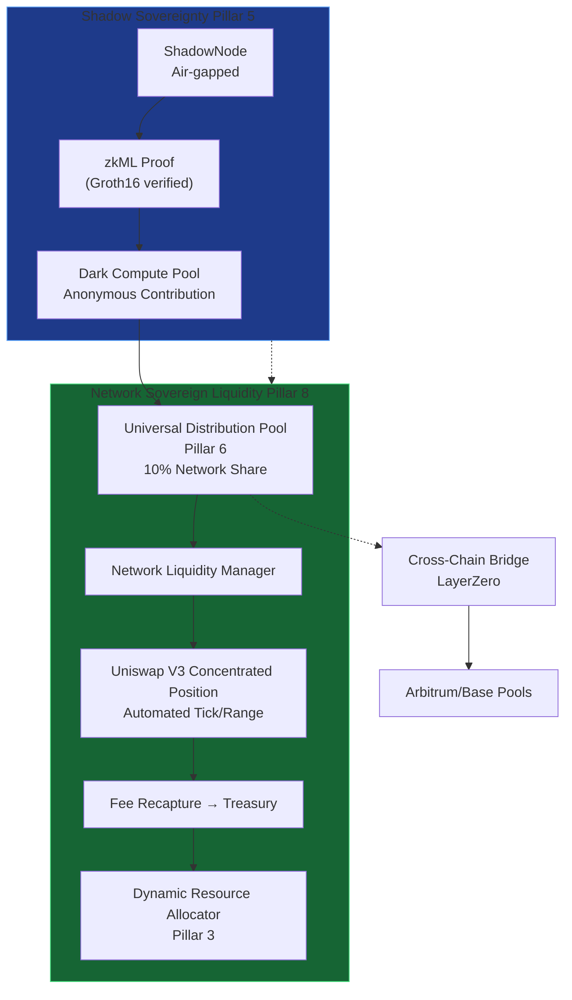

# AXIOM-MESH Master Integration (v8.1)

All 8 pillars are now wired into a single self-managing LangGraph state machine (`hypervisor/agents/master_autonomy_graph.py`). The network is fully sovereign, multi-chain, self-training, self-distributing, and self-liquifying.

## 8 Pillars of AXIOM-MESH Sovereignty
1. Blockchain Autonomy & DeploymentFactory
2. Autonomous ML Training & ModelRegistry
3. Dynamic Resource Management & FounderShareManager
4. Automated Workforce & Digital Legacy
5. Shadow Sovereignty & Dark Compute Pool
6. Universal Distribution Pool (payroll/UBI/donations)
7. Cross-Chain Sovereignty (LayerZero + Wormhole)
8. **Network Sovereign Liquidity** (autonomous LP management, concentrated Uniswap V3, fee recapture)

## System Architecture Diagram


## Detailed Liquidity Flow (Shadow zk → Network Liquidity)


## Quick Start (one command)
```bash
forge script script/DeployAllPillars.s.sol --rpc-url $RPC_URL --broadcast --verify
python -m hypervisor.agents.master_autonomy_graph
```

## Deployment & Verification
All contracts are UUPS upgradeable, verified on Ethereum + Arbitrum + Base via the CI/CD pipeline (.github/workflows/deploy-verify.yml).
Founder control is invisible and permanently locked via FounderCommitment.sol. Every action (liquidity provision, cross-chain bridge, payroll, shadow contribution) is bicameral-governed and WORM-audited.
This is the complete sovereign system.
Run it. Deploy it. Own the future.
