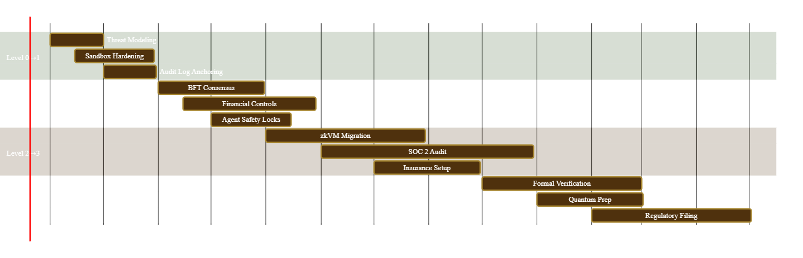

Based on the security audit findings, here is a **5-Level Production Readiness Framework** specifically designed to mature AXIOM-MESH from its current prototype state to enterprise-grade deployment.

---

# AXIOM-MESH Production Readiness Roadmap
**Maturity Model: 0 → 4 (Crawl → Walk → Run → Fly → Scale)**

---

## Level 0: Current State (Prototype/Alpha)
**Status:** *Unsafe for Value* | **Goal:** Stabilization & Threat Modeling

### Current Reality Check
| Component | State | Blocker |
|-----------|-------|---------|
| Treasury Split | Partial impl | No atomic L1 reconciliation |
| zkML Verification | Prototype | Unverified soundness |
| Sandbox Airgap | 60% complete | Rust UDS not wired |
| Ledger Persistence | BadgerDB WAL | Byzantine fault tolerance missing |
| Agent Autonomy | Active loops | No formal termination proofs |

### Exit Criteria (Level 0 → 1)
- [ ] Complete all "Caveats" documentation to "Implementation" status
- [ ] Freeze feature addition; bugfix-only mode
- [ ] Establish formal threat model (STRIDE per component)
- [ ] Implement chaos engineering baseline (failure injection)

---

## Level 1: Hardened Alpha (Single-Tenant Secure)
**Timeline:** 3-4 months | **Risk Level:** Medium | **Value Cap:** <$10K

### 1.1 Security Architecture Hardening

**Sandbox Escape Prevention**
```yaml
Implementation:
  - Complete airgap.rs integration with UDS control socket
  - Implement gVisor or Kata Containers as alternative runtime
  - Add eBPF syscall monitoring (Falco/Tetragon) with deny-rules
  - Rootless Docker enforcement (user namespaces mandatory)
Validation:
  - 30-day red team exercise focused on container escape
  - CPU side-channel testing (Spectre/Meltdown resistance)
```

**Authentication & Authorization**
```yaml
Gateway:
  - Replace API-key model with mTLS + short-lived JWT (SPIFFE/SPIRE)
  - Implement intent payload signatures (EIP-712 style)
  - Add behavioral biometrics for admin actions

Hypervisor:
  - UCP (Universal Consent Protocol) formal verification
  - Multi-sig requirements for high-impact agent actions
```

### 1.2 Financial Controls Foundation
**Treasury Split v1.0 (Single-Tenant)**
- Implement **local-first accounting** with strict eventual consistency to L1
- Add circuit breaker: Auto-pause distributions if Grid/L1 delta > 0.01%
- 24-hour timelock on all founder share withdrawals
- Daily automated reconciliation reports (signed by oracle network)

### 1.3 zkML Safety Harness
- **Proof system hardening:** Engage Zellic/Trail of Bits for circuit audit
- Implement proof recursion limits (prevent infinite proof generation loops)
- Add model checksum verification (SHA-256 of weights published on-chain)
- Fallback mode: If zkML fails, degrade to TEE-verified inference (AWS Nitro/Intel SGX)

### 1.4 Audit & Monitoring
- Immutable audit logs anchored to Ethereum (via LogStore or similar)
- Real-time alerting on:
  - Intent processing latency anomalies (>3σ)
  - Sandbox network namespace violations
  - Grid ledger hash mismatches

---

## Level 2: Staged Beta (Multi-Tenant with Guardrails)
**Timeline:** 4-6 months | **Risk Level:** Medium-High | **Value Cap:** <$500K

### 2.1 Byzantine Fault Tolerance (Grid Layer)
**Distributed Ledger Hardening**
```go
// Grid improvements for production
- Implement HotStuff or PBFT consensus (replace current hot-memory maps)
- Add slashing conditions for equivocation (double-signing)
- State snapshot encryption at rest (AES-256-GCM with HSM-backed keys)
- Cross-shard transaction atomicity (two-phase commit)
```

**Bicameral Governance Activation**
- On-chain bicameral voting (House of Stake + House of Skills)
- Veto power distribution: Founders (5%) + Token holders (60%) + Skill validators (35%)
- Emergency pause mechanism with 4-of-7 multisig (geographically distributed)

### 2.2 Financial Audit Interconnect (SOX/GAAP Ready)
**Revenue Recognition Engine**
| Feature | Implementation | Audit Trail |
|---------|---------------|-------------|
| Real-time booking | Double-entry for Grid operations | SHA-256 chained blocks |
| Founder share calc | Smart contract view function | Immutable parameter snapshots |
| UBI distribution | Merkle-tree airdrops with claim proofs | On-chain event emission |
| Tax withholding | Automated 1099/1042-S generation | Off-chain secure enclave |

**Internal Controls (SOX Compliance)**
- **Segregation of Duties:** Split DeploymentFactory access across 3 roles (Deployer, Guardian, Auditor)
- **Change Management:** Implement TimelockController (48-hour delay) + OpenZeppelin Defender for contract upgrades
- **Access Reviews:** Quarterly attestation of all admin keys via EIP-4361 (Sign-In with Ethereum)

### 2.3 AI Agent Safety Locks
**AutoResearch/AutoTraining Constraints**
```python
# Master Autonomy Graph hardening
- Resource caps: Max $100 spend per autonomous session
- Human-in-the-loop: Critical actions require Discord/Slack approval via OAuth2
- Kill switches: Circuit breaker on iteration count (max 100 loops)
- Alignment verification: Output must pass constitutional AI checks before execution
```

**Prompt Injection Defense**
- Deploy Lakera Guard or Prompt Armor for intent sanitization
- Implement semantic analysis layer (separate from Gateway hygiene)
- Canary tokens in system prompts (detect exfiltration attempts)

### 2.4 Supply Chain Security
- **SLSA Level 3 compliance:** Reproducible builds with Sigstore signing
- **Dependency freeze:** Pin all packages with `pip-compile` + `npm ci` + `go mod verify`
- **Container hardening:** Distroless images, non-root users, read-only filesystems
- **SBOM generation:** CycloneDX manifests for every release

---

## Level 3: Production MVP (Mainnet with Limits)
**Timeline:** 6-9 months | **Risk Level:** High | **Value Cap:** $5M TVL

### 3.1 Cryptographic & zkML Production
**Zero-Knowledge Infrastructure**
- Migrate from prototype zkML to **RISC Zero** or **SP1 zkVM** for general compute verification
- Implement **verifiable delay functions (VDF)** for randomness in skill staking
- Add **zk-SNARK recursion** for batching proof submissions (reduce L1 gas costs)

**Oracle Hardening**
- Chainlink Price Feeds + API3 dAPIs (redundant sources)
- Implement **Optimistic Oracle** pattern for disputed inference results (UMA protocol)
- Stake-weighted aggregation for off-chain data (prevent single-source manipulation)

### 3.2 Economic Security (Financial Audit Grade)
**ComputeBond v2.0**
- **Over-collateralization:** 150% bond requirement for skill validators
- **Slashing conditions:** Formal specification with appeal process (7-day review window)
- **Insurance fund:** 2% of treasury dedicated to covering smart contract hacks
- **Atomic settlements:** Grid ledger operations settle to L1 within 1 block (using CCIP or LayerZero)

**Audit Interconnect APIs**
```yaml
Financial Endpoints:
  - GET /audit/v1/balance-sheet (real-time assets/liabilities)
  - GET /audit/v1/cash-flow (treasury movements)
  - POST /audit/v1/journal-entry (manual corrections with 4-eyes approval)

Compliance:
  - Automated FATF Travel Rule compliance for transfers >$1000
  - KYC/AML integration (SumSub/Onfido) for UBI on-ramps
  - GDPR right-to-erasure implementation (crypto-shredding for PII)
```

### 3.3 Autonomous Agent Governance
**AI Constitution Implementation**
- Deploy **Collective Constitutional AI** (CCAI) framework for agent alignment
- Bicameral oversight of agent upgrades: Technical council + Ethics council
- **Value alignment oracles:** External auditors vote on agent goal functions quarterly

**Shadow Sovereignty Mode**
- Air-gapped node deployment guides (Tails OS + hardware wallets)
- Dark Compute Pool activation for privacy-preserving inference
- **Plausible deniability storage**: Shamir's secret sharing for sensitive model weights

### 3.4 Disaster Recovery & Business Continuity
- **Cold wallet setup:** 3-of-5 multisig for treasury, keys in bank vaults (3 cities)
- **State rollback capability:** Daily encrypted snapshots to Arweave (permanent storage)
- **Degraded mode playbook:** Automated switch to "safe mode" if >30% of Grid nodes fail
- **Insurance coverage:** Cyber liability policy covering $5M+ in damages

---

## Level 4: Enterprise Production (Full Scale)
**Timeline:** 9-12 months | **Risk Level:** Managed | **Value Cap:** Unlimited

### 4.1 Institutional Compliance
**Regulatory Frameworks**
- **SOC 2 Type II:** Audit controls for security, availability, processing integrity
- **ISO 27001:** Information security management system certification
- **MiCA compliance:** European crypto-asset regulation adherence
- **SEC registration:** If AA (Account Abstraction) bonds deemed securities, complete Reg D/S filing

**Financial Auditing Standards**
- **GAAP compliance:** Revenue recognition aligned with ASC 606 (software/SAAS)
- **Proof of Reserves:** Monthly attestations by third-party auditor (Armanino/Mazars)
- **Real-time auditing:** Grant read-only access to financial regulators via ZK-view keys (they see balances without seeing individual transactions)

### 4.2 Advanced Security Architecture
**Zero-Trust Mesh**
- **SPIFFE identity:** Every service has cryptographic identity (x.509 SVIDs)
- **mTLS everywhere:** All inter-service communication encrypted and authenticated
- **Policy as Code:** Open Policy Agent (OPA) enforcing fine-grained authorization
- **Confidential Computing:** AMD SEV-SNP for Hypervisor memory encryption

**Quantum Resistance**
- Post-quantum cryptography migration (CRYSTALS-Dilithium for signatures)
- Hash-based backup keys for treasury (Lamport signatures)

### 4.3 Autonomous Economic Stability
**Dynamic Resource Management**
- **Automated Market Maker (AMM)** for compute resources ( Grid spots vs. demand)
- **Bonding curve adjustments:** Algorithmic modification of founder share based on network growth
- **Cyclical treasury rebalancing:** Quarterly portfolio optimization (crypto/fiat/stablecoin mix)

**Crisis Management Protocols**
- **Black swan response:** Automatic system halt if TVL drops >50% in 24h
- **Governance attacks:** 9-of-13 emergency council for parameter changes during attacks
- **Oracle failure:** Fallback to manual price feeding with 12-hour delays

### 4.4 Continuous Verification
**Formal Methods**
- TLA+ specifications for consensus algorithms
- Coq proofs for smart contract invariants (treasury cannot be drained, etc.)
- Model checking for agent state machines (verify no deadlocks/livelocks)

**Red Team Retainer**
- Annual $500K budget for continuous penetration testing
- Bug bounty program (Immunefi): $50K-$1M rewards for critical vulnerabilities
- War game exercises: Quarterly simulation of founder key compromise, 51% attacks, etc.

---

## Implementation Roadmap (Gantt Overview)



---

## Financial Audit Interconnect Checklist

| Phase | Accounting Standard | Blockchain Component | Internal Control |
|-------|-------------------|---------------------|------------------|
| Level 1 | Cash basis | Simple payment tracking | Founder review |
| Level 2 | Accrual basis | Revenue recognition contracts | Automated reconciliation |
| Level 3 | GAAP | ASC 606 compliance | External auditor access |
| Level 4 | IFRS + GAAP | Real-time ZK financial statements | Continuous monitoring |

---

## Go/No-Go Decision Gates

**Gate 1 (Before Level 2):** Can the system survive a $100K bug bounty period with no critical finds?
**Gate 2 (Before Level 3):** Has a Big-4 auditor signed off on the treasury split logic?
**Gate 3 (Before Level 4):** Has the zkML system passed a cryptanalysis review by academic peers?

---

**Recommendation:** Begin Level 1 immediately with a dedicated security engineering team (min. 3 FTEs). Do not enable the "Universal Distribution Pool" for external funds until Level 3 gate is passed. The current prototype is suitable for internal dogfooding and testnet value only.