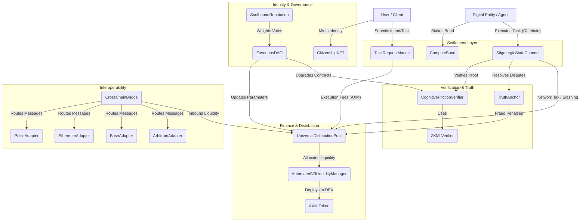

# AXIOM-MESH Smart Contract Map & Architecture

This document maps the entire smart contract architecture, illustrating the subsystems and the flow of value, identity, and execution within the AXIOM-MESH protocol.

## 1. High-Level Subsystems

The AXIOM-MESH smart contract suite is divided into six logical domains:

1.  **Core Tokens & NFTs (`grid/contracts/contracts/token/`)**
    *   `AXM.sol`: The canonical network token.
    *   `CitizenshipNFT.sol` / `DistributorNFT.sol`: Identity and role-based access tokens.
2.  **Governance (`grid/contracts/contracts/governance/`)**
    *   `ZoverionsDAO.sol`: The central bicameral voting mechanism.
    *   `Futarchy.sol`: Market-based policy predictions.
    *   `SoulboundReputation.sol`: Meritocratic trust scoring that influences voting weight.
3.  **Finance & Distribution (`grid/contracts/contracts/finance/`)**
    *   `UniversalDistributionPool.sol`: The heart of the network's economy, collecting and distributing all fees (60% Security Fund, 40% Wealth Generation).
    *   `AutomatedV3LiquidityManager.sol`: Manages protocol-owned liquidity on Uniswap V3 forks.
    *   `StablecoinPayroll.sol`: Handles linear vesting and recurring payments.
4.  **Execution & Settlement (`grid/contracts/contracts/`)**
    *   `StigmergicStateChannel.sol`: Optimistic settlement layer for off-chain execution (Layer 2).
    *   `TaskRequestMarket.sol`: Escrow for human/agent task coordination.
    *   `ComputeBond.sol`: Staking requirements for active nodes.
5.  **Verification (`grid/contracts/contracts/security/`)**
    *   `CognitiveFrictionVerifier.sol` / `ZKMLVerifier.sol`: Validates zero-knowledge proofs of execution and reasoning (PoER).
    *   `TruthAnchor.sol`: Challenge and resolution market for off-chain claims.
6.  **Cross-Chain Interoperability (`grid/contracts/contracts/core/`)**
    *   `CrossChainBridge.sol`: The central hub for moving assets between chains.
    *   `PulseAdapter.sol`, `EthereumAdapter.sol`, `BaseAdapter.sol`, `ArbitrumAdapter.sol`: Network-specific messaging handlers.

---

## 2. Interaction Flow Diagram (Mermaid)

## 3. The Core Economic Loop (How they interconnect)

1.  **Staking:** An Agent stakes AXM into `ComputeBond.sol` to join the active Grid.
2.  **Execution:** A User funds a task in `TaskRequestMarket.sol`. The Agent executes the task off-chain and opens a `StigmergicStateChannel.sol` for optimistic settlement.
3.  **Verification:** The state channel calls `CognitiveFrictionVerifier.sol` to ensure the zkML execution trace is valid.
4.  **Settlement:** Once the challenge window closes (weighted by `SoulboundReputation.sol`), the state channel settles. The Agent is paid, and a **Network Tax (fee)** is automatically routed to the `UniversalDistributionPool.sol`.
5.  **Distribution:** The `UniversalDistributionPool.sol` splits the revenue (60% Network Security Fund, 40% Wealth Generation Pool) and uses the `AutomatedV3LiquidityManager.sol` to deepen the protocol's liquidity on decentralized exchanges.