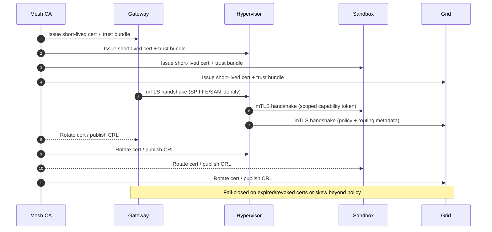

# AXIOM-MESH Architecture (Canonical)

**Document role:** Canonical architecture baseline for AXIOM-MESH.
**Last updated:** 2026-04-08.
**Scope:** Runtime topology, control/data planes, trust boundaries, and release architecture constraints.

---

## 1) System Topology

AXIOM-MESH is composed of four runtime pillars plus on-chain governance/economic contracts.

> Terminology: repository docs also reference an eight-pillar sovereignty model for platform capability planning (`docs/MASTER-INTEGRATION.md`). This architecture document remains the canonical runtime topology view.

1. **Gateway (TypeScript)**
   - External ingress for user/API traffic.
   - Authentication, authorization, request shaping/rate limits, and workflow dispatch.
2. **Hypervisor (Python)**
   - Orchestration brain for intents, policy evaluation, and execution planning.
   - Coordinates proof requirements, resource balancing, and fallback/degraded behaviors.
3. **Sandbox (TypeScript + containerized runtimes)**
   - Isolated execution surface for tools/capsules.
   - Enforces capability boundaries and runtime policies.
4. **Grid (Go)**
   - Mesh coordination, ledger/state synchronization, and consensus-adjacent behavior.
   - Supports node membership and persistence/replay flows.
5. **Contracts & Governance Layer (Solidity + off-chain governance process)**
   - Tokenomics, staking/reward rails, parameter control, and policy voting hooks.

---

## 2) Canonical Interaction Flow

At a high level, a production intent follows this sequence:

1. **Ingress:** Gateway receives and validates an intent.
2. **Decisioning:** Hypervisor evaluates policy, trust requirements, and execution plan.
3. **Execution:** Sandbox executes approved tool/capsule actions under constraints.
4. **Coordination:** Grid records/broadcasts stateful outcomes as required.
5. **Settlement/Policy:** Contract layer enforces economic/governance side effects when applicable.
6. **Evidence:** Logs, proofs, and release artifacts are retained for auditability.

This sequence is intentionally fail-closed for privileged operations.

---

## 3) Architecture Boundaries

### 3.1 Control Plane
Includes policy decisions, governance parameters, approvals, and emergency controls.

### 3.2 Data Plane
Includes user intents, execution payloads, model/tool inputs/outputs, and persistence artifacts.

### 3.3 Trust Boundaries
- **Public edge → Gateway** (highest exposure; strict validation/rate-limiting).
- **Gateway ↔ Hypervisor** (authenticated internal calls; policy-aware handoff).
- **Hypervisor ↔ Sandbox** (least-privilege execution tokens/profiles).
- **Grid ↔ chain/external systems** (finality/reconciliation-aware integration).

### 3.4 Trust-Boundary Diagram (Mermaid)
```mermaid
flowchart LR
    public[Public Clients / Partners]
    gw[Gateway
API ingress + authn/authz]
    hv[Hypervisor
Policy + orchestration]
    sb[Sandbox
Isolated execution]
    grid[Grid
State sync + consensus]
    chain[(Contracts / External Chains)]

    public -->|HTTPS (WAF + rate limits)| gw
    gw -->|mTLS + JWT claims| hv
    hv -->|mTLS + scoped exec token| sb
    hv -->|mTLS service RPC| grid
    grid -->|Signed tx + finality checks| chain

    classDef trust fill:#fff4d6,stroke:#d48a00,stroke-width:2px;
    classDef core fill:#e7f0ff,stroke:#1f5fbf,stroke-width:1px;
    class public trust;
    class gw,hv,sb,grid,chain core;
```

### 3.5 mTLS Service Identity & Rotation Flow (Mermaid)


---

## 4) Core Invariants (Must Hold)

1. **No unauthenticated privileged path.**
2. **No policy bypass from Sandbox to control-plane actions.**
3. **No silent state mutation without auditable evidence.**
4. **No release promotion without gate evidence (security, reliability, economics, docs).**
5. **No architecture claims that exceed verified implementation status.**

---

## 5) Reliability and Degraded-Mode Architecture

AXIOM-MESH is designed for graceful degradation:
- Queue/deferral over data loss at ingress.
- Controlled fallback for unavailable upstream services.
- Replay-safe ledger/state restoration paths.
- Explicit operator runbooks for partition and verification-failure scenarios.

Primary references:
- `docs/OPERATIONS.md`
- `docs/DEGRADED-MODE-PLAYBOOK.md`
- `docs/TEST-STRATEGY.md`

---

## 6) Security-by-Architecture Requirements

- Strong service identity and authenticated service-to-service calls.
- Sandboxed execution with constrained capability profiles.
- Abuse controls at ingress (rate limits, validation, request shaping).
- Evidence-backed audit trails and replay capability.
- Separation of operational roles for high-risk actions.

Primary references:
- `docs/SECURITY-HARDENING.md`
- `docs/CRYPTOGRAPHY-POSTURE-MATRIX.md`
- `docs/COORDINATED-BEHAVIOR-THREAT-MODEL.md`

---

## 7) Canonical References

For adjacent canonical sources:
- Governance model: `docs/GOVERNANCE.md`
- Operations runbook: `docs/OPERATIONS.md`
- Program roadmap: `docs/ROADMAP.md`
- Execution queue: `docs/MASTER-TODO.md`
- Technical contract/interface details: `docs/TECHNICAL-SPECIFICATION.md`, `docs/INTERFACE-CONTROL-DOCUMENT.md`
