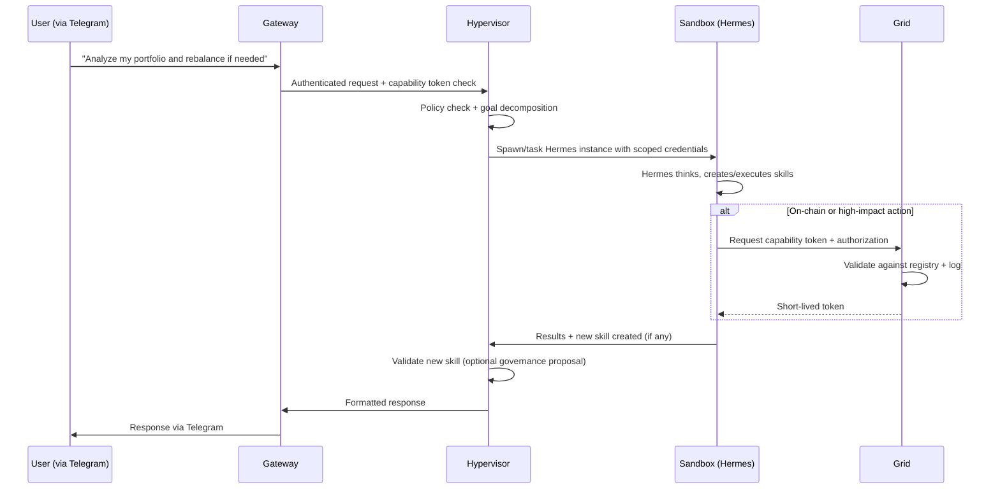

# Hermes Agent Integration into AXIOM-MESH
## Sovereign Self-Improving Agent Runtime

**Version:** 0.1 (Draft for internal discussion)
**Date:** May 6, 2026
**Author:** Architecture Team (with Grok assistance)
**Status:** Proposal / Sketch

---

## 1. Executive Summary
This document outlines a reference architecture for running Hermes Agent (Nous Research) as a first-class, governed capability inside the AXIOM-MESH 4-pillar runtime.

Instead of operating Hermes as a standalone daemon, we embed it deeply into AXIOM-MESH to achieve:
- **Fail-closed safety** via hardened Sandbox execution
- **Economic sovereignty** and on-chain governance via Grid
- **Authenticated capabilities** across messaging platforms and blockchains
- **Self-improving skills** that become reusable, governed AXIOM-MESH capabilities
- **Multi-chain reach** from day one (primary deployment on PulseChain)

**Key Outcome:** AXIOM-MESH becomes one of the most secure and sovereign runtimes available for next-generation self-improving AI agents.

---

## 2. Background

### Hermes Agent (Nous Research)
- Self-improving AI agent with built-in learning loop
- Creates, refines, and reuses skills from experience
- Persistent memory across sessions
- Supports CLI + 16+ messaging platforms (Telegram, Discord, etc.)
- Scheduled automations, sub-agents, browser automation, tools
- **Latest:** v0.12.0 (as of late April 2026)
- **Official migration path from OpenClaw:** `hermes claw migrate`
- **Crypto plugin available:** `clawmes`

### AXIOM-MESH 4-Pillar Runtime
1. **Gateway:** Authenticated ingress, channel adapters, UX delivery
2. **Hypervisor:** Orchestration, policy routing, context/memory management, execution planning
3. **Sandbox:** Isolated secure execution (Docker + stronger controls)
4. **Grid:** Ledger, consensus, contract integration, multi-chain support (PulseChain primary)
- **Core Guarantees:** Economic sovereignty, governance closure, fail-closed safety, mTLS zero-trust communication.

---

## 3. High-Level Architecture

```mermaid
flowchart TB
    subgraph External["External World"]
        User[User / Messaging Platforms]
        ExtSystems[External Systems & APIs]
    end

    subgraph AXIOM_MESH["AXIOM-MESH Runtime"]
        direction TB
        Gateway[Gateway\nAuthenticated Ingress\nMessaging Adapters\nCapability Tokens]

        Hypervisor[Hypervisor\nOrchestration & Policy\nSkill Validation\nMemory Routing\nLifecycle Mgmt]

        Sandbox[Sandbox\nHardened Container\nHermes Agent Runs Here\nTool Execution + Sub-Agents]

        Grid[Grid\nOn-Chain Identity & Wallet\nCapability Registry\nImmutable Audit Log\nGovernance & Economics\nMulti-Chain Adapters]
    end

    User -->|Authenticated requests| Gateway
    ExtSystems -->|API calls| Gateway

    Gateway -->|Policy check + routing| Hypervisor
    Hypervisor -->|Spawn / Task with scoped creds| Sandbox
    Sandbox -->|Critical actions\n(on-chain, high-impact)| Grid

    Grid -->|Auth tokens + logs| Hypervisor
    Hypervisor -->|Results + updates| Gateway
    Gateway -->|Responses| User

    style Sandbox fill:#0D9488,stroke:#134E4A,color:#fff
    style Grid fill:#6366F1,stroke:#4338CA,color:#fff
    style Hypervisor fill:#14B8A6,stroke:#0F766E,color:#fff
    style Gateway fill:#0F172A,stroke:#334155,color:#fff
```

**Visual Summary:**
- **Sandbox** is the primary execution home for Hermes.
- **Hypervisor** acts as the intelligent conductor.
- **Grid** provides the sovereignty and governance layer.
- **Gateway** ensures all external interaction is authenticated and controlled.

---

## 4. Pillar-by-Pillar Integration Details

### 4.1 Sandbox Pillar — Execution Environment
- Hermes runs inside a hardened, namespaced Docker container (or stronger isolation provided by AXIOM-MESH).
- All LLM inference, tool calls, browser automation, code generation, and sub-agent spawning occur here.
- Hypervisor can snapshot filesystem state before risky operations.
- Instant kill + rollback capability on policy violation (true fail-closed behavior).
- Hermes’ native sandboxing is retained but wrapped by AXIOM-MESH’s stronger guarantees.

**Integration Points:**
- Docker Compose service: `hermes` under `sandbox/` networking.
- Volume mounts restricted; secrets injected via Hypervisor-scoped env vars.
- Real-time monitoring hooks into Hypervisor.

### 4.2 Hypervisor Pillar — Orchestration & Policy Brain
- Manages Hermes lifecycle (spawn, pause, update, migrate, terminate).
- **Policy engine enforces:**
    - Allowed LLM providers/models
    - Tool/skill allowlists
    - Economic spend limits
    - On-chain permission scopes
- Memory router decides what stays local vs. selective commit to Grid.
- **Skill validation gate:** New skills created by Hermes are reviewed; high-impact ones can trigger Grid governance proposals.
- Execution planner decomposes goals into Hermes tasks + other AXIOM-MESH capabilities.

### 4.3 Gateway Pillar — Secure External Interface
- All interaction with Hermes is mediated.
- Supports Hermes’ native platforms but wrapped with AXIOM-MESH authentication (capability tokens, mTLS, scoped sessions).
- **Exposes:**
    - Web dashboard / API for management
    - Messaging channel adapters (with rate limiting & audit)
    - Capability token issuance for external actions.

### 4.4 Grid Pillar — Sovereignty, Governance & Economics
This is the differentiator that makes the integration powerful:
- **Agent Identity:** Hermes represented by smart contract / DID on PulseChain. Keys never leave Grid-controlled boundary.
- **Capability Registry & Tokens:** Short-lived tokens required for powerful actions (on-chain tx, external API calls, high-impact skills).
- **Immutable Audit Log:** Skill creation, on-chain transactions, governance actions, large memory commits logged on-chain.
- **Governance Closure:** Upgrading Hermes, approving risky skills, changing policy, or expanding economic power requires on-chain proposal + vote (leveraging existing `CONSTITUTION.md` + Grid).
- **Economic Sovereignty:** Hermes can hold/spend tokens under governed rules (daily limits, treasury access, etc.).
- **Multi-Chain Execution:** Grid adapters allow Hermes to act across chains while primary governance/audit stays on PulseChain.
- **`clawmes` Crypto Plugin:** Adapted so wallet/DEX/staking calls route through Grid-signed transactions.

---

## 5. Data & Control Flow (Example)



---

## 6. Implementation Roadmap (Phased)

| Phase | Name | Key Deliverables | Target Timeline |
| :--- | :--- | :--- | :--- |
| 1 | **Containment** | Hermes containerized in Sandbox; Basic Hypervisor orchestration & lifecycle commands; `hermes update` support | 2-3 weeks |
| 2 | **Auth & Identity** | Grid-backed agent identity + DID; Capability token issuance for tool calls | 3-4 weeks |
| 3 | **Governance** | On-chain proposals for skill approval, policy changes, version upgrades | 4-5 weeks |
| 4 | **Memory & Economics** | Hybrid memory (local + selective Grid commits); Governed wallet & spend controls | 3-4 weeks |
| 5 | **Multi-Agent & Crypto** | Sub-agent spawning with different permission scopes; Adapted `clawmes` plugin via Grid | 4-5 weeks |
| 6 | **Production Hardening** | Full monitoring, Web dashboard integration, migration tooling, performance tuning, security audit | 4-6 weeks |

**Total estimated:** 20-25 weeks for full production-grade integration.

---

## 7. Benefits vs Standalone Hermes

| Benefit | Standalone Hermes | Hermes inside AXIOM-MESH |
| :--- | :--- | :--- |
| **Safety / Containment** | Good (own sandbox) | Excellent (fail-closed + Hypervisor kill switch) |
| **Economic Sovereignty** | Local wallet only | On-chain governed treasury & spend limits |
| **Governance** | None / manual | On-chain proposals & voting |
| **Auditability** | Local logs | Immutable on-chain audit trail |
| **Multi-chain** | Manual / plugins | Native via Grid adapters |
| **Skill Reusability** | Local only | Becomes governed AXIOM-MESH capability |
| **Identity & Permissions** | Local files | Contract-controlled + capability tokens |
| **External Access** | Direct (less controlled) | Fully authenticated & rate-limited via Gateway |

---

## 8. Code & Configuration Sketches

### 8.1 Docker Compose Addition (`docker-compose.yml`)
```yaml
services:
  hermes:
    build:
      context: ./sandbox/hermes
      dockerfile: Dockerfile.hermes
    container_name: axiom-hermes
    networks:
      - axiom-mesh-internal
    volumes:
      - hermes-data:/home/hermes/.hermes
      - /var/run/docker.sock:/var/run/docker.sock:ro  # if needed for sub-containers
    environment:
      - HERMES_CONFIG=/config/hermes.yaml
      - AXIOM_HYPERVISOR_URL=http://hypervisor:8000
      - AXIOM_GRID_RPC=${PULSECHAIN_RPC}
    depends_on:
      - hypervisor
      - grid
    restart: unless-stopped
    # Strong security options
    security_opt:
      - no-new-privileges:true
    read_only: true
    tmpfs:
      - /tmp

volumes:
  hermes-data:
```

### 8.2 Hypervisor Policy Example (Python pseudocode)
```python
# hypervisor/policies/hermes_policy.py

HERMES_POLICY = {
    "allowed_models": ["nous-hermes-3", "llama-3.1-70b", "gpt-4o"],
    "max_daily_spend_usd": 50,
    "allowed_tools": ["web_search", "browser", "code_execution", "pulsechain_read"],
    "high_risk_tools": ["send_transaction", "stake_tokens"],
    "requires_grid_approval": ["send_transaction", "create_skill_high_impact"],
    "memory_commit_threshold": "important_facts_only",
    "max_sub_agents": 3,
    "sandbox_isolation_level": "strict",
}

def validate_hermes_action(action: dict, context: dict) -> bool:
    if action["type"] in HERMES_POLICY["high_risk_tools"]:
        return request_grid_capability_token(action, context)
    return True
```

### 8.3 Grid Smart Contract Sketch (Solidity - simplified)
```solidity
// grid/contracts/contracts/HermesAgentRegistry.sol
// SPDX-License-Identifier: MIT
pragma solidity ^0.8.19;

contract HermesAgentRegistry {
    struct Agent {
        address owner;
        bytes32 did;
        uint256 dailySpendLimit;
        mapping(bytes32 => bool) approvedSkills;
    }

    mapping(bytes32 => Agent) public agents;

    function requestCapability(bytes32 agentId, bytes32 actionHash) external returns (bytes32 token) {
        // Validate against policy, emit event for audit
        // Return short-lived capability token
        return keccak256(abi.encodePacked(agentId, actionHash, block.timestamp));
    }

    function proposeSkillUpgrade(bytes32 agentId, bytes32 skillHash) external {
        // Governance proposal logic
    }
}
```

### 8.4 Migration Path from Standalone Hermes
Users can run:
```bash
hermes claw migrate --preset full --target-axiom-mesh
```
*(We would extend the existing migration command or provide a wrapper script that also registers the agent on Grid.)*

---

## 9. Open Questions & Risks
1. **Performance overhead** of running inside AXIOM-MESH layers.
2. **LLM provider integration** — how to securely pass API keys (Hypervisor secret injection).
3. **Skill provenance** — should every new skill created by Hermes require human or on-chain approval?
4. **Resource limits** — CPU/memory quotas per Hermes instance.
5. **`clawmes` adaptation** — effort required to make crypto plugin Grid-aware.
6. **Observability** — exporting Hermes metrics/logs into existing Prometheus setup.

---

## 10. Recommended Next Steps
1. Review this document in internal architecture meeting.
2. Approve Phase 1 scope and assign owners.
3. Create `docs/architecture/HERMES_INTEGRATION_ARCHITECTURE.md` (this file) in the repo.
4. Add the generated visual diagram to `docs/assets/`.
5. Prototype Phase 1 (Sandbox + basic Hypervisor orchestration).
6. Schedule follow-up for detailed security review.

---
**Appendix A: Visual Diagram**
A high-resolution architecture diagram is located at: `docs/assets/hermes-axiom-mesh-architecture.jpg`
