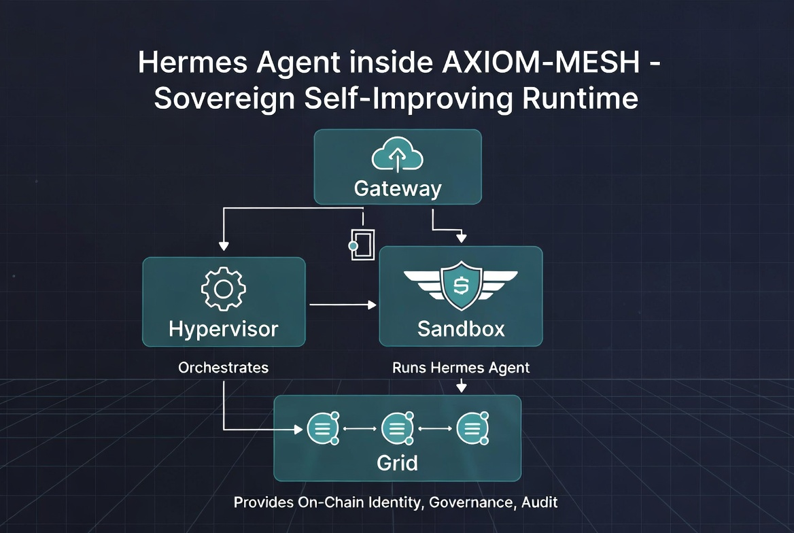

# Hermes Integration Slide Deck

<!--
To render as slides, use a tool like Marp or just view as headers.
Theme: Dark / Tech
-->

---

# Slide 1: Hermes Integration into AXIOM-MESH
## Sovereign Self-Improving Agent Runtime

---

# Slide 2: Why Integrate?
### 6 Key Benefits
1. **Fail-Closed Safety**: Hardened sandbox with instant kill switch.
2. **Economic Sovereignty**: On-chain governed treasury and spend limits.
3. **Governance Closure**: All major changes require on-chain voting.
4. **Immutable Audit**: Every critical action logged on PulseChain.
5. **Self-Improving Skills**: Skills become reusable, governed mesh capabilities.
6. **Multi-Chain Reach**: Native access to multiple chains via Grid adapters.

---

# Slide 3: High-Level Architecture

---

# Slide 4: 4-Pillar Mapping
*   **Gateway**: Authenticated ingress & messaging platform adapters.
*   **Hypervisor**: Policy enforcement, lifecycle management, and memory routing.
*   **Sandbox**: Secure, isolated execution of the Hermes runtime.
*   **Grid**: Identity, capability tokens, and immutable audit logs on PulseChain.

---

# Slide 5: Key Benefits & Differentiators
| Benefit | Standalone Hermes | Hermes inside AXIOM-MESH |
| :--- | :--- | :--- |
| **Safety** | Good (own sandbox) | Excellent (fail-closed) |
| **Sovereignty** | Local wallet | On-chain governed |
| **Governance** | None | On-chain proposals |
| **Audit** | Local logs | Immutable on-chain |

---

# Slide 6: Implementation Roadmap
*   **Phase 1**: Containment (Sandbox + Basic Orchestration) - 2-3 weeks
*   **Phase 2**: Auth & Identity (Grid DID + Tokens) - 3-4 weeks
*   **Phase 3**: Governance (On-chain proposals) - 4-5 weeks
*   **Phase 4**: Memory & Economics (Hybrid memory) - 3-4 weeks
*   **Phase 5**: Multi-Agent (Sub-agent spawning) - 4-5 weeks
*   **Phase 6**: Production Hardening - 4-6 weeks

---

# Slide 7: Recommended Next Steps
1.  **Review** proposal in architecture meeting.
2.  **Approve** Phase 1 scope.
3.  **Initialize** `docs/` and `sandbox/hermes` directories.
4.  **Prototype** basic containerized lifecycle in Sandbox.
5.  **Schedule** security review for Grid capability tokens.
